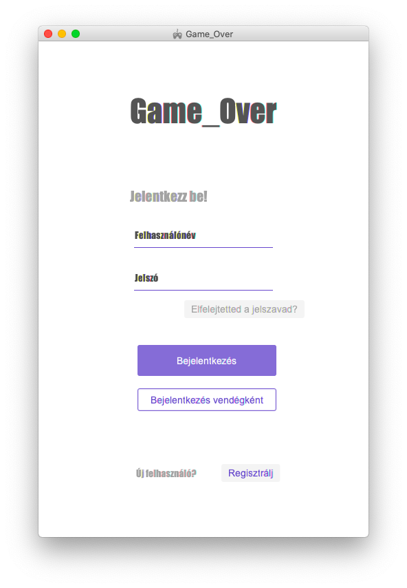
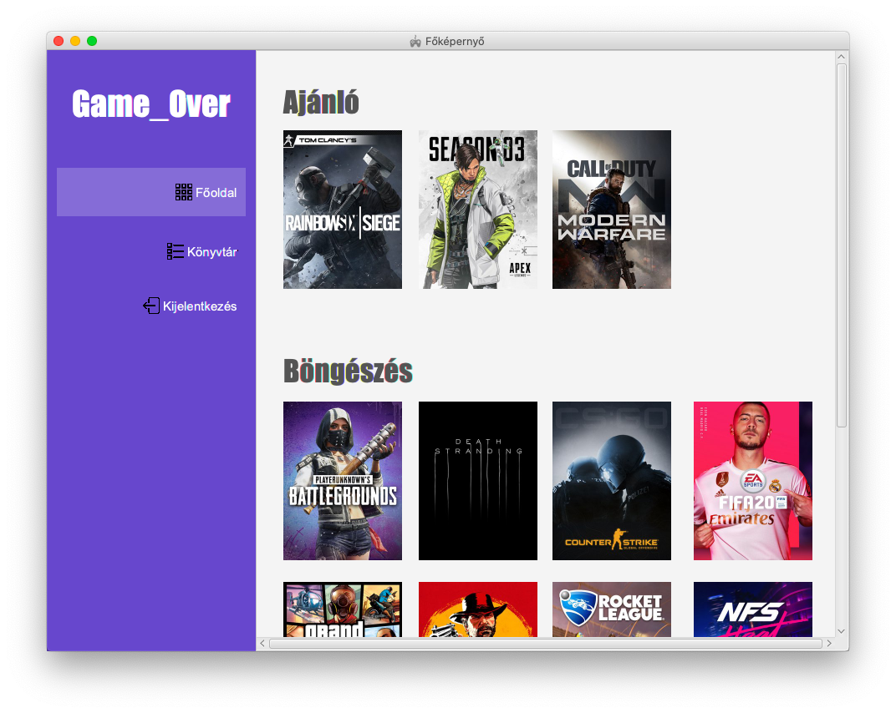
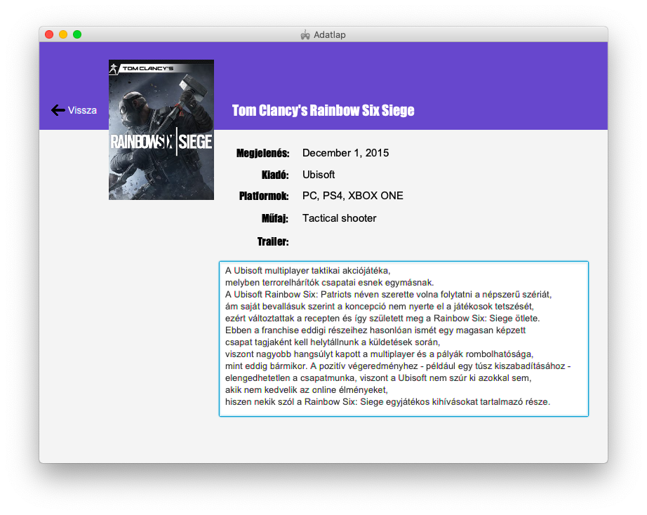

# GameOver: Rendszerterv

### Tartalomjegyzék

- [A rendszer célja]()
- [Projekt terv]()
- [Üzleti folyamatok modellje]()
- [Követelmények]()
- [Funkcionális terv]()
- [Fizikai környezet]()
- [Architekturális terv]()
- [Tesztterv]()
- [Telepítési terv]()
- [Karbantartási terv]()

## I. A rendszer célja

Rendszerünk célja elsősorban az lenne, hogy minden játékosnak segítsünk
megtalálni a számára megfelelő számítógépes játékot, amivel kikapcsolódhat
egy hosszú és fárasztó nap után, vagy esetleg elütheti vele a szabadidejét.
Céljaink közé tartozik biztosítani a felhasználók számára a saját kedvenceik
gyűjtését, illetve azon játékok gyűjtését is, melyeket egyáltalán nem kedvelnek.
Ezen felül szeretnénk tágítani ügyfeleink látókörét is azzal, hogy a bejelentkezést
követően az adott felhasználó, az általa leggyakrabban megtekintett fajtába tartozó
játékokból ajánlunk neki 3 darabot, melyekkel még nem találkozott az alkalmazásban
Szeretnénk, ha rendszerünkben a navigálás egyszerű és gyors lenne, ezért egy 
felső menüvel képzeltük el az átirányítások megvalósítását. Privát szférát kívánunk
biztosítani felhasználóinknak, ennek érdekében pedig egy bejelentkezési lehetőséget
is biztosítunk számukra.

## II. Projekt terv

### 1. Projektszerepkörök, felelősségek

| Szerepkör     | Felelősség   |
| :-----------: | :----------: |
| Felhasználók  | Szakszerűen használják a programot. |
| Fejlesztők    | Legjobb tudásuk szerint megalkotják a programot amit elvállaltak. |

### 2. Projektmunkások és felelősségeik

| Projektmunkások | Felelősség   |
| :-------------: | :----------: |
| Tarcsa Tamás    | Back end       |
| Bakos Bálint    | Back end       |
| Erdei Kristóf   | Front end       |
| Tóth Csaba      | Front end       |

### 3. Ütemterv

| Dátum      | Haladás                                           |
| :--------: | :-----------------------------------------------: |
| 2019.10.21 | Követelmény-, Funkcionális specifikáció elkészült |
| 2019.11.04 | Rendszerkövetelmények ekészült                    |

## III. Üzleti folyamatok modellje

Napjainkban a domináns játéklisták nagytöbbsége valamilyen nagy vállalat/cég kezében van,
ezért csak azokat a játékokkal, játék megjelenésekkel fog találkozni a közönség, amelyeket az
adott cég reklámoztat vagy adja ki a neve alatt. Emiatt hogy ha a tudakozódó "naív", akkor csak
egy, példuál Origin vagy Ubisoft, játékokkal fog találkozni a játékos, mert számára nem jön 
információ más játékokról, nem olvas széles körben jártas oldalakat/magazinokat. Nincs sok olyan
gyártótól független weboldal vagy szoftver, ami a lehető legtöbb játékot képes lenne a felhasználó
számára megjeleníteni, mind gyártótól, kiadásától, témájától függetlenül. Éppen ezért nagy szükség
van olyan programra, ami felhasználó barát, teljes mértékben tud azonosulni mind a tájékozatlan
felhasználóval, mind a tapasztalt játékközönséggel egyaránt. Viszont, éppen ezt a problémát orvosolva
fejlesztjük ki a jelenlegi projektünk alatt a "Game_Over" programot, aminek a segítségével a
felhasználó könnyedén képes rengetek játékok között barangolni, gyártótól teljesen függetlenül,
tehát megadjuk a felhasználóknak azt a fajta szabadságát, hogy képes legyen ténylegesen az 
ízlésének megfelelő játékokkal találkoznia, ezáltal nem fogja azt érezni, hogy egy adott gyártó
eröltetve el akarna neki adni valamit, amit nem is szeretne soha kipróbálni. 

Felhasználóinknak 
továbbá biztosítunk egy regisztráció/belépés lehetőséget, _ami persze nem kötelező, ha valaki csak
kipróbálni szeretné az alkalmazásunkat akkor nem kötelezzük rá, hogy csak néhány alkalom miatt
regisztráljon, ekkor vendégként is beléphet_, ezzel tovább növelve azt az érzetet a játékosokban, hogy teljesen
személyére vannak szabva az általa kedvelt játékok. Ha valaki nem csak vendégként lép be az 
alkalmazásunkba, hanem sikeres regisztáció után be is lép, akkor képesek leszünk ajánlani minden 
nap a felhasználónak 3 darab különböző játékot amiket úgy véltünk, hogy tetszeni fog neki, persze 
ha esetleg mellélőnénk a találgatásunkkal, akkor nyilvánvalóan lehetősége van az ajánlatokat
mellőzni. De ha sikerül nekünk olyan játékokat ajánlani már a bejelentkezést követően,
vagy a játékok barangolása közben olyan játékkal találkozik, ami tetszhet neki, akkor azt jelezve
bekerül minden regisztrált felhasználónak a saját könyvtárába, ahol bármikor újra megnézheti, felkeresheti
azokat. Az alkalmazásunkban képes lesz bárki olyan féle játékkeresésre, ami számára lényeges,
például az adott témájára, kiadójára, kiadási dátumára vagy ha csak az ár a fontos, akkor
a szerint is képes lesz keresni. Alkalmazásunkat a lehető legszélesebb körben szeretnénk, ha használnák
az emberek, bárhol, bármikor amikor csak szükségük lenne rá, tudják használni. Ezért igyekszünk 
olyan felhasználóbarát, gyors, rugalmas, modern kinézetű szoftvert fejleszteni ami eleget tesz
ezeknek a feltételeknek és bárki csak ajánlani tudná ismerőseinek.

## IV. Követelmények

Mivel a célunk egy sok retegű közönség kiszolgálására alkalmas alkalmazás megírása, ezért biztosítanunk
kell, hogy olyan felhasználó is tudja könnyedén használni a programunkat, aki még a számitógép
kezelésében nincsen otthon. Emiatt programunknak könnyen értelmezhetőnek, világosnak, egyértelműnek
kell hogy legyen. A **felhasználói felület**et, a felhasználó szemszögéből próbáljuk megalkotni, 
dizájnolni, hogy minél átláthatóbb legyen minden egyes ablak, amiket csak használni fog. Mivel
ez az alkalmazás teljes mértékben ízléseken alapszik (gondolunk itt a játék ízlésre), ezért 
biztosítanunk **kell** egyéni profil létrehozást, amit már programunk elindítása után már rögtön 
ajánlunk is a felhasználóinknak. Így mindenki a maga ízlésének megfelelő játékokkal tud csak 
találkozni. Illetve ha már regisztrációt kínálunk a felhasználóinknak, akkor egyúttal biztosítanunk 
kell, hogy képes legyen jelszavának a módosítására is, ha esetleg elfelejtette volna a már 
korábban megadott jelszavát. Minden felhasználó, _még aki vendégként jelentkezett is be_, 
legyen lehetősége játékokat megkeresni, a lehető legtöbb szürési lehetőségekkel: kiadó, kiadási dátum, ár, téma.

Csak a regisztrált felhasználóknak van lehetősége **egyéni könyvtárak nyílvántartására**, ahol minden eddigi
elmentett játékok szerepelnek, ezáltal bármikor visszakereshet egy már korábban bekedvelt játékot, ha
esetleg elfelejtette volna egy adott játék nevét például. Legyen képes a felhasználó bizonyos szintű
visszacsatolásra az adott játékkal kapcsolatban, gondolunk itt az adott **játék értékelésére** egy 1-től
5-ig tartó skálán. További élmények növelése érdekében legyen képes a felhasználó a keresett 
játékról szóló előzetesnek a megtekintésére, ami nagyban megkönnyítheti vagy segíthet annak az 
eldöntésében, hogy szeretné-e kipróbálni az adott játékot. Ha már ott tartunk, hogy sok ember számára kívánjuk létrehozni az alkalmazásunkat, 
akkor fontos, hogy akadás mentesen fusson, illetve a lehető legkisebb tárhelyet kell hogy foglalja
a felhasználó számítogépén. További bővítési célunk, hogy az internetről is elérhető legyen a 
programunk, ezért később fontos lesz, hogy a lehető legkisebb adatforgalomat használja és hogy 
egyszerre a lehető legtöbb ember tudja használni gördülékenyen, akadás és mindenféle hiba mentesen.

| Megnevezés |
| :-----------:
| Regisztráció
| Bejelentkezés
| Kijelentkezés
| Új jelszó
| Bejelentkezés vendégént
| Főoldal
| Könyvtár
| Adatlap
| Adatbázis

## V. Funkcionális terv

A rendszer fejlesztésének elsődleges célja, ahogyan azt már az I. fejezetben
is említettük, a játékosok látókörének szélesítése, illetve, hogy mindenki
megtalálhassa a számára megfelelő játékot. Terveink szerint rendszerünk
mindenki számára elérhető lesz, akár otthoni, akár konyvtári vagy internetkávézói
környezetben is. Fiatalabb és idősebb korosztályok számára is egyaránt
ajánljuk használatát, hiszen minden korosztály számára fontos a játék,
a kikapcsolódás, a szórakozás. Szeretnénk elérni azt, hogy aki kezébe
veszi az alkalmazásunkat, az úgy álljon fel előle, hogy megtalálta azt
a játékot amit szeretett volna vagy talált valami olyat, amilyenre vágyott.
Úgy terveztük felhasználói felületetünket, hogy az azok számára is egyszerű
és érthető legyen, akinek még sosem volt dolga esetleg előtte hasonlóval.
Letisztult és egyszerű dizájnt terveztünk, igyekeztünk csak annyira bonyolítani
a dolgokat, amennyire muszáj. Emiatt is kényelmes  és vonzó a felhasználók
számára használata, illetve nagy játék adatbázisunk is, amiben szinte az összes
jelenleg már megjelent és bejelentett, de még nem megjelent játék is megtalálható.
A maximális felhasználói élmény elérése érdekében rendszerünk igyekszik
az apróbb hibákat a háttérben kezelni, hogy ne zavarja meg a felhasználók
böngészését. Nagyobb hibák esetén azonban kénytelenek vagyunk a felhasználó
számára jelezni, hogy valamilyen hiba történt. Terveink szerint a fejlesztő
csapat a hiba mindkét fajtája esetén jelentést kap, amit utána igyekszenek
minél előbb kijavítani.

#### Bejelentekező felület:

#### Főoldal:

#### Játék adatlapja:

## VI. Fizikai környezet

### 1. Adatok tárolása - Hibernate

Szükségünk van legalább 2 táblára, melyek közül egyikben a felhasználók
adatait, míg a másik a játékok adatait tárolja. Hogy elérjük adatbázisunkat
egy objektum-relációs leképezést megvalósító programkönyvtárat, Hibernate-t
fogunk használni, melynek segítségével az osztályainkat és a relációs
adatbázisunk tábláit képezzük egymásba.

### 2. Operációs rendszer - Linux, Windows,

A programot szeretnénk ha egyaránt lehetne futtatni Linuxon és Windowson is, így reméljük
nagyobb népszerűségre tesz szert a hordozhatósága miatt. Linuxra elég egyszerűen eltudjuk
készíteni, mivel ebben már van a csapatnak tapasztalata. A kihívás a Windows-os problémamentes
futtatás, mivel ezt még eddig nem próbáltuk.

### 3. Programozási nyelv - Java

Programozási nyelv egyszerűen a Java lesz, mivel ezaz a nyelv amiben mindenkinek van
elég tapasztalata egy szoftver elkészítéséhez. Pontosan a Java SE Development Kit 11-et fogjuk
alkalmazni. Tehát minden gép amelyen ezt a szoftvert szeretnénk használni elengedhetetlen ez
a csomag.

### 4. Felhasználói felület - JavaFX

Ahhoz, hogy szép és elfogadható kinezetű programot kapjunk a JavaFX grafikus technológiát
használjuk. Valamint fxml fájlokat használva szerkesztjük a kinézetet, amiknek könnyű,
grafikus felületű szerkesztéséhez a JavaFX scene builder alkalmazását fogjuk
használni, mely számos előnnyel rendelkezik.

## VII. Architekturális terv

### 1. Architekturális tervezési minta

Korábbi projektjeinkhez hasonlóan itt is az ismert és gyakran alkalmazott MVC, magyar fordításban
MNV, azaz Modell-Nézet-Vezérlő elveit fogjuk követni. Ez annyit jelent, hogy főleg a projekten 
dolgozók dolgát nagyban megkönnyíti ez az elv, miszerint 3 fő részre bontjuk az alkalmazásunkat.
Egyik réteg tartalmazza a megjelenést, azaz a felhasználói felületet amivel a programunk használója
fog találkozni. Ezen keresztül tud kapcsolatba lépni a felhasználó a további rétegekkel, persze 
a tudta nélkül, ami képes működtetni az egész szoftvert. A másik réteg az úgynevezett "logikai" 
réteg, ami a felhasználó által véghezvitt interakciókat értelmezi, dolgozza fel, például jelen 
esetben a felhasználó valamit beír a játék keresőbe vagy épp a program bármelyik gombjára 
rákattint. Harmadrészt áll az adattárolást kezelő részből. Ennél a projektünknél a különböző 
felhasználóktól kapott felhasználói neveket és a hozzátartozó jelszavakat tároljuk, hogy a későbbiekben 
biztonságosan tudjanak belépni. Adatbázist fogunk még használni a rengetek játékokkal kapcsolatos 
információk tárolására, amikkel majd a felhasználó találkozhat az alkalmazásunkban. Illetve regisztrált 
felhasználónként eltároljuk azokat a játékokat személyes könyvtárként, amiket bekedvelt vagyis 
érdeklődik iránta. Ezzel a tervezési mintával tervezzük megvalósítani a projektünket, amivel 
reményeink szerint, a kódunkat is nagyban átláthatóbbá fogja tenni.

### 2. Az alkalmazás rétegei, fő komponensei, ezek kapcsolatai

A korábban említett, az ismert Modell-Nézet-Vezérlő vezérlő elveit követve alakítjuk ki programunk 
rétegeit. Amint a felhasználó elindítja a programot, választhat, hogy milyen módon kíván belépni 
az alkalmazásba, hogy ha egy saját profillal szeretne belépni, akkor bejelentkezhet ha van már 
regisztrált profilja, ha nincs akkor regisztrálhat. A sikeres regisztrációt követően a felhasználó 
által begépelt adatok elmentésre kerülnek az adatbázisunkba. Már itt megfigyelhető, hogy miképpen 
kapcsolódnak az alkalmazott rétegek, miszerint a felhasználó begépel valamit, amit a vezérlőnk 
feldolgoz és bekerül az adatbázisunkba. Hasonló kapcsolat figyelhető meg a sikeres regisztráció 
utáni belépést illetően, ahol már az ismételten beírt felhasználói név és a hozzátartozó jelszó 
lesz ellenőrizve az adatbázisban már megadott adatokkal. Fontos részét képezi az alkalmazásunknak 
a keresés az adatbázisban lévő játékok között. A keresést lehet szűrni mint kiadási dátummal, 
kiadója szerint vagy akár témáját illetően is. Ha a keresőfelületbe beír például egy játék címet, 
akkor azt a programunk készségesen megkeresi, illetve visszaadja a felhasználónak, amennyiben az 
létezik. Saját könyvtára is lesz a regisztrált felhasználóknak, ahol egy külön adatbázisként kezelve 
lesznek megtalálhatóak a felhasználó által korábban bekedvelt játékok. Végül de nem utolsó sorban 
fontos részét képezi az alkalmazásunknak a tesztelés. Fontos, hogy minél több tesztet írjunk 
a programunkhoz ezáltal biztosítva annak sikerét.

### 3. Változások kezelése

Rendszerünk fő céljai között szerepel az, hogy bármikor, bárki által hozzáférhető legyen a programunk. 
Fontos számunkra, hogy tiszta, átlátható kódot írjunk, illetve többek között a rétegelt architektura 
is segít ebben. Azért fontos, hogy átlátható kódot irjunk, mert esetleges csapatbővítéskor vagy 
ha valami kód részlet megváltoztatása nagyon szükségszerű, akkor az könnyedén, kevés időbefektetéssel 
történjen.

### 4. Rendszer bővíthetősége

Mivel napjainkban napról napra rengetek játékmegjelenésről beszélhetünk, ezért fontos tényező az, 
hogy ezzel együtt folyamatosan tudjuk bővíteni a programunkat. Többek között könnyedén bővíthető 
az alkalmazásunk keresési szűrők által, aminek a segítségevel a felhasználók pontosabban rá tudnak 
keresni egy-egy játékra. Minél több és szélesebb a játékbázisunk, annál nagyobb a valószínűsége, 
hogy a szoftverünk a lehető legtöbb kezek között megfog fordulni,ezért igyekszünk alkalmazásunkat
úgy megtervezni, hogy bővíthetősége egyszerű és könnyen kivitelezhető legyen.

## VIII. Tesztterv

### 1. Első körös

A **tesztterv** megintcsak egy olyan fejezetet takar, ami valószínűleg kevésbé tűnik fontos
feladatnak, emiatt sok projekt során elfelejtődik. Vagy lustaság, vagy időhiány miatt. Ami nagy
hiba. Mert igenis nagy jelentőséggel bír. Ezért a mi csapatunk fejlesztése során szintén fontos
pont a rendszerünk sikeres elkészítésének folyamatában az, hogy megfelelő tesztelést vigyünk
véghez. Semmiféleképpen sem szeretnénk azt, ha a kiadás után bármilyen hiba maradna a
programunkban. Legyen az súlyos, vagy akár kevésbé súlyos. Illetve azt is mindenféleképpen
szeretnénk elkerülni, ha valami nem úgy működne ahogyan mi elképzeltük. Vagy még rosszabb
esetben egyáltalán nem. Mivel ebben az esetben a felhasználók nagy része hamar elpártolna a 
programtól és a későbbiekben szinte lehetetlen lenne őket visszacsábítani. Mindezek elkerülése
érdekében folyamatosan felügyelni és ellenőrizni fogjuk a rendszerünk működését, már a 
fejlesztés elkezdésének legelső szakaszaiban is. Mindezen felül egy több lépcsőből álló 
tesztelési tervet fogunk megvalósítani. **Egyrészt** *JUnit* egységteszt keretrendszert 
fogunk használni. Ez annyit tesz, hogy a kód írásával párhuzamosan fejlesztjük a kódot tesztelő
osztályokat is. Ezek az egység tesztek, ami akkor hibátlan, ha az összes teszt hibátlanul lefut.

### 2. Második körös

**Másrészt** külön tesztelési jegyzőkönyvet fogunk vezetni manuálisan, amiben alaposan
átvizsgálunk minden egyes funkciót. Ebben is részt fog venni a csapatunk összes tagja annak
érdekében, hogy minden lehetséges esetet végig tudjunk nézni és ténylegesen minden esetleges
hibát sikerüljön felfedni. **Harmadrészt** pedig a későbbiekben, vagyis a program elkészülte
után, de még a hivatalos megjelenés előtt külsős tesztelőket is szeretnénk majd bevonni a
teljes siker érdekében. Akiknek mindössze annyi a feladatuk, hogy huzamosabb ideig használják
a programot és jelentsék ha bármit észre vesznek. Meg azt is ha akad valamilyen észrevételük.
Mindennek tökéletesen kell működnie ahhoz, hogy a teszttervünk **sikeres**nek mondható legyen.
Kezdve azzal, hogy a felhasználói felületek rendesen betöltődnek-e, a menü elemek, a gombok, a
felületek amikkel interakcióba lépnek a felhasználók mind mind működnek, méghozzá pontosan úgy
ahogy azt mi elvárjuk. A bejelentkezés folyamatának működőképesnek és gördülékenynek kell
lennie. Pont úgy, mint minden más részegységnek is. A program legyen megfelelőképp gyors,
hogy a felhasználónak öröm legyen használnia. Csapatunk a tesztelési eredményeket részletesen
fogja dokumentálni.

### 3. Harmadik körös

Az eredmények függvényében két lépés közül tudunk majd választani. Hiba
vagy hibák esetén, azok javítása után újra végigcsináljuk a teszteket és visszaadjuk a
projektet a tesztelő csoportnak. Ha viszont nem található hiba a rendszerben, akkor pedig a
projekt átadásra kerülhet a megrendelő felé. A projekt átadása után tervezünk majd *béta
verzió*kat kiadni, amelyeket a vállalkozó szellemű felhasználók használhatnak, ezáltal a hibák
ki tudnak derülni addig, amíg az a *release* lesz az éles.

| Tesztesetek |
| :-----------:
| Program elindítása
| Regisztráció
| Új jelszó
| Kilépés
| Bejelentkezés
| Bejelentkezés vendégént
| Főoldal megjelenítése
| Főoldal menüpont
| Könyvtár menüpont
| Kijelentkezés
| Játék adatlap megjelenítése

## IX. Telepítési terv

A programunk **telepítés**e az első fázisban a következőképpen fog kinézni. Az adott
számítógépen szükség lesz a **Maven** szoftverre, amelyet szoftverprojektek menedzselésére
és a build folyamat automatizálására lehet használni. Illetve rendelkezésre kell állni minimum
a **Java 8**-as verziójának a futattáshoz. Parancssorban a program könyvtárában állva az *mvn
compile* paranccsal lefordítjuk byte kódra a forráskódot. Majd az *mvn package* paranccsal
egy jar fájlt hozunk létre, amely a target nevű mappába kerül. Ezáltal pedig a *java -jar
Game_Over-1.0-SNAPSHOT.jar* futtatható maga a szoftver. Ha minden rendelkezésre áll, akkor
gond nélkül lehet majd futtatni az alkalmazást. Illetve ha szükség van rá, akkor szívesen
segítünk a **Java** környezet, a **Maven** telepítésében és a **program telepítésében** is,
illetve bemutatjuk a szoftver működését is. A későbbiekben természetesen szeretnénk minél
inkább leegyszerűsíteni ezt a folyamatot, hogy minél kényelmesebb legyen a telepítés. Az a
tervünk, hogy egy telepítő segítségével elvégezhetővé váljon az installáció. Távolabbi célunk
pedig az, hogy ne csak *offline*, hanem *online* is elérhető legyen a programunk. Ezáltal tud
majd eljutni minél szélesebb körökbe. Gondolunk ezalatt az **App Store**-ra és a **Microsoft
áruház**ra és a projektünk saját, dedikált holnapjáról is elérhető lesz a telepítés. Ahol
tutorial is megtalálható lesz hozzá, aminek segítségével ismertetjük a használatát.

## X. Karbantartási terv

A megfelelő **karbantartási terv** végrehajtását szintén fontos teendőnknek tekintjük a
projektünk életében. Természetesen programunkat annak elkészülte és kiadása után sem
szeretnénk semmiféleképpen sem befejezettnek tekinteni. A sikeres tesztterv végrehajtása
után sem garantált az, hogy semmilyen hiba nem fog előfordulni a későbbiekben. Emiatt ezeket
az eseteket mindenféleképpen javítani szeretnénk majd minél hamarabb, nem hagyva cserben a
felhasználóinkat. De ez csak egy kis része a teljes elképzelésünknek. Mivel emellett
szeretnénk a jövőben tovább *fejleszteni* a szoftverünket, folyamatosan és minél több *új
funkció*t hozzáadva. Ennek érdekében szeretnénk minél szorosabb köteléket kialakítani a
felhasználói bázisunkkal és tartani velük a kontaktok. Erre lehetőségük lesz a honlapon és
magán az alkalmazáson belül is. Illetve privátban is el tudják majd érni a fejlesztő csapatunk
tagjait. Hallgatni fogunk az ő *észrevételeik*re is, sőt várjuk is az észrevételeket és az
*ötletek*et. Emellet, ha bármilyen probléma merül fel a felhasználók részéről, annak
megoldásában készségesen a segítségükre fogunk állni. Értelemszerűen a jövőben érkezni fognak
kisebb, nagyobb **frissítések**. Amiket szintén tesztelni fogunk, ahogy az a teszttervek
fejezet alatt részletesen megtalálható. Célunk, hogyha ez a projekt egy minél szélesebb skálát
fedne le a **gaming** témakörön belül. Ezért nagy szükség van a rendszeres *újítások*ra, hogy
fent tudjuk tartani a felhasználók igényeit és meg tudjunk felelni az elvárásaiknak. Fontos,
hogy a program felhasználói felület ne avuljon el, mindig megfeleljen az adott trendeknek.
Erre fel vagyunk készülve, nagy hangsúlyt fogunk fektetni a projektünk precíz karbantartására.
A felhasználói elégedettség az egyik legfontosabb dolog számunkra, emiatt nem is engedhetjük
meg magunknak, hogy ne foglalkozzunk szoftverünkkel a lehető leghoszabb ideig.